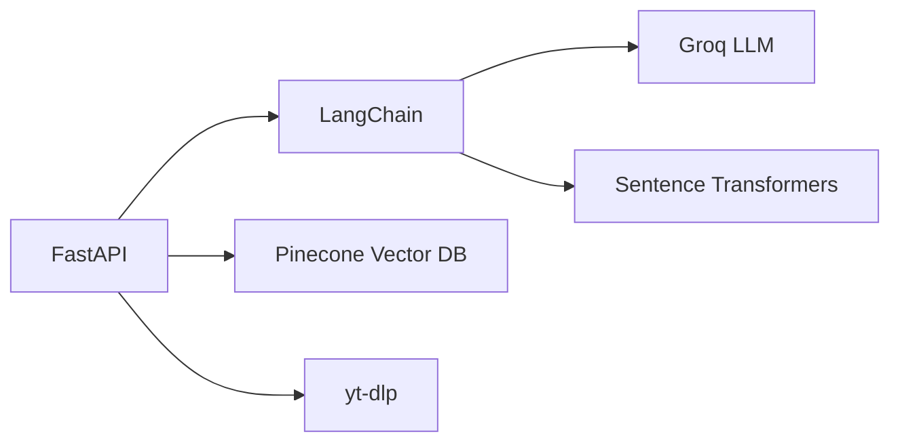
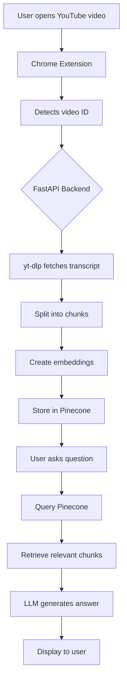

# 🎬 YouTube Chatbot - AI-Powered Video Q&A Assistant

[](https://www.python.org/)
[](https://fastapi.tiangolo.com/)
[](https://www.langchain.com/)
[](https://groq.com/)
[](https://www.pinecone.io/)
[](https://developer.chrome.com/docs/extensions/)

> **Transform any YouTube video into an interactive Q&A experience using RAG (Retrieval-Augmented Generation) and LLMs**

---

## 📋 **Table of Contents**
- [Problem Statement](#-problem-statement)
- [Solution Overview](#-solution-overview)
- [Features](#-features)
- [Tech Stack](#-tech-stack)
- [Architecture](#-architecture)
- [Installation](#-installation)
- [Usage](#-usage)
- [API Endpoints](#-api-endpoints)
- [Deployment](#-deployment)
- [Contributing](#-contributing)
- [License](#-license)

---

## 🚨 **Problem Statement**

### **The Challenge**
In today's information-rich world, video content is exploding, but extracting insights remains difficult:
- **Time-Consuming**: Watching full videos to find specific information
- **Inefficient**: No quick way to query video content
- **Language Barriers**: Transcripts are messy and unstructured
- **Memory Constraints**: Can't remember everything from long videos
- **Limited Accessibility**: Deaf users rely on captions but need better navigation

### **The Gap**
YouTube has billions of videos, but there's no intelligent way to:
- Ask questions about a video and get instant answers
- Extract key insights without watching the entire content
- Use natural language to query video transcripts
- Get AI-powered summaries and analysis

---

## 💡 **Solution Overview**

**YouTube Chatbot** bridges this gap by combining:
- 🧠 **RAG (Retrieval-Augmented Generation)** for accurate context retrieval
- 🤖 **LLM (Large Language Model)** for natural language understanding
- 📚 **Vector Database** for semantic search
- 🔍 **Real-time Transcript Processing** for any YouTube video

### **How It Works**
1. **User opens a YouTube video** → Extension detects the video
2. **Automatic Transcript Fetching** → Extracts captions/subtitles
3. **Vector Embedding** → Converts text to vector representations
4. **Intelligent Retrieval** → Finds relevant content based on user questions
5. **AI-Powered Answering** → Generates accurate, context-aware responses

### **What Makes It Special**
- ✅ **Zero Learning Curve**: Just open any YouTube video and ask
- ✅ **Real-Time Processing**: No waiting for pre-indexing
- ✅ **Multi-Video Support**: Works with any video that has captions
- ✅ **Accurate Responses**: Uses RAG to ensure factual accuracy
- ✅ **Chrome Extension**: Seamless integration with YouTube

---

## ✨ **Features**

### 🌟 **Core Features**
| Feature | Description |
|---------|-------------|
| **🎯 Video Detection** | Automatically detects the current YouTube video |
| **📝 Transcript Extraction** | Fetches and processes video captions/transcripts |
| **🔍 Semantic Search** | Uses vector embeddings for intelligent search |
| **💬 AI-Powered Q&A** | Answers questions using RAG and LLMs |
| **⚡ Real-Time Processing** | Indexes videos on-demand |
| **🔒 Secure API Keys** | Uses `.env` for secure credential management |

### 🚀 **Advanced Features**
| Feature | Description |
|---------|-------------|
| **🧠 RAG Pipeline** | Retrieval-Augmented Generation for accuracy |
| **📊 Vector Database** | Pinecone for efficient similarity search |
| **🤖 Multiple LLMs** | Supports Groq, OpenAI models |
| **🌐 Chrome Extension** | Native YouTube integration |
| **📈 Performance** | Fast indexing and response times |
| **🛡️ Secret Scanning** | GitHub security compliance |

### 🎯 **Use Cases**
- **Students**: Quickly understand lecture videos
- **Researchers**: Extract insights from talks and presentations
- **Content Creators**: Get video summaries for descriptions
- **Deaf Users**: Navigate videos using text-based queries
- **Language Learners**: Practice with transcripts and translations

---

## 🛠️ **Tech Stack**

### **Backend**


| Technology | Purpose |
|------------|---------|
| **FastAPI** | High-performance API framework |
| **LangChain** | LLM orchestration and RAG pipeline |
| **Groq** | Ultra-fast LLM inference |
| **Pinecone** | Vector database for semantic search |
| **Sentence Transformers** | Text embedding generation |
| **yt-dlp** | YouTube transcript extraction |
| **Uvicorn** | ASGI server for FastAPI |

### **Frontend**
| Technology | Purpose |
|------------|---------|
| **Chrome Extension** | Browser integration |
| **HTML/CSS/JS** | User interface |
| **Chrome API** | Video detection |

### **DevOps & Security**
| Technology | Purpose |
|------------|---------|
| **Python 3.12** | Core language |
| **Docker** | Containerization |
| **GitHub Actions** | CI/CD pipeline |
| **.env** | Secure credential management |

---

## 🏗️ **Architecture**



### **Data Flow**
1. **Video Detection**: Extension gets YouTube video ID
2. **Transcript Processing**: Backend fetches and cleans transcript
3. **Vector Indexing**: Text chunks converted to vectors and stored
4. **Query Processing**: User questions converted to vectors
5. **Retrieval**: Similar chunks found in Pinecone
6. **Answer Generation**: LLM creates context-aware response

---

## 📦 **Installation**

### **Prerequisites**
- Python 3.12+
- Chrome Browser
- Groq API Key
- Pinecone API Key

### **1. Clone the Repository**
```bash
git clone https://github.com/Aditya-Sharma-dev18/Advance-YT-Chatbot.git
cd Advance-YT-Chatbot
```

### **2. Setup Backend**
```bash
cd backend
python -m venv venv
source venv/bin/activate  # On Windows: venv\Scripts\activate
pip install -r requirements.txt
```

### **3. Configure Environment**
```bash
cp .env.example .env
# Edit .env with your API keys:
# GROQ_API_KEY=your_key_here
# PINECONE_API_KEY=your_key_here
```

### **4. Load Chrome Extension**
1. Open Chrome → `chrome://extensions/`
2. Enable **Developer mode**
3. Click **Load unpacked**
4. Select `extension/` folder

### **5. Run the Backend**
```bash
python app.py
```

---

## 🎯 **Usage**

### **Quick Start**
1. **Open a YouTube video** in Chrome
2. **Click the extension icon** in toolbar
3. **Ask a question** like "What is this video about?"
4. **Get instant AI-generated answer!**

### **Example Questions**
- "Summarize the main points"
- "What does the speaker say about [topic]?"
- "Explain the key concepts"
- "What is the conclusion?"

### **API Usage**
```python
# Ask a question
POST /api/ask
{
  "videoId": "Z2CZ8mkECpU",
  "question": "What is this video about?"
}

# Index a video
POST /api/index-video
{
  "videoId": "Z2CZ8mkECpU"
}

# Check indexing status
GET /api/check-video/Z2CZ8mkECpU
```

---

## 📡 **API Endpoints**

| Endpoint | Method | Description |
|----------|--------|-------------|
| `/` | GET | API health check |
| `/docs` | GET | Swagger UI documentation |
| `/api/ask` | POST | Ask a question about a video |
| `/api/index-video` | POST | Index a YouTube video |
| `/api/check-video/{id}` | GET | Check video indexing status |
| `/api/delete-video/{id}` | DELETE | Remove video from index |
| `/api/health` | GET | Health check endpoint |

---

## 🚀 **Deployment**

### **Option 1: Render.com **
```yaml
# render.yaml
services:
  - type: web
    name: youtube-chatbot
    runtime: python
    buildCommand: pip install -r requirements.txt
    startCommand: uvicorn app:app --host 0.0.0.0 --port 10000
    envVars:
      - key: GROQ_API_KEY
        sync: false
      - key: PINECONE_API_KEY
        sync: false
```

### **Option 2: Docker**
```dockerfile
FROM python:3.12-slim
WORKDIR /app
COPY requirements.txt .
RUN pip install -r requirements.txt
COPY . .
CMD ["uvicorn", "app:app", "--host", "0.0.0.0", "--port", "8000"]
```

### **Option 3: Railway.app**
- Connect GitHub repository
- Automatic deployment on push
- Environment variables supported

---

## 🔧 **Troubleshooting**

### **Common Issues**

| Problem | Solution |
|---------|----------|
| **ModuleNotFoundError** | `pip install -r requirements.txt` |
| **API Key Error** | Check `.env` file and verify keys |
| **Video Not Indexing** | Ensure video has captions/subtitles |
| **CORS Error** | Configure CORS in FastAPI |
| **Port 5000 in Use** | Change port in `app.py` |

### **Performance Tips**
- Use `llama-3.1-8b` for faster responses
- Optimize chunk size for better retrieval
- Enable caching for frequent queries

---

## 🤝 **Contributing**

### **How to Contribute**
1. **Fork** the repository
2. **Create** a feature branch
3. **Commit** changes
4. **Push** to the branch
5. **Open** a Pull Request

### **Guidelines**
- Follow PEP 8 style guide
- Write docstrings for functions
- Add comments for complex logic
- Update README for new features

---

## 📄 **License**

This project is licensed under the MIT License - see the [LICENSE](LICENSE) file for details.

---

## 🙏 **Acknowledgments**

- **Groq** for ultra-fast LLM inference
- **Pinecone** for vector database capabilities
- **LangChain** for RAG pipeline
- **yt-dlp** for YouTube transcript extraction
- **OpenAI** for GPT models

---

## 🏆 **Project Status**


---

## 📞 **Contact & Support**

- **GitHub Issues**: [Report a bug](https://github.com/Aditya-Sharma-dev18/Advance-YT-Chatbot/issues)
- **Email**: [sharma.adityaaa0001@gmail.com](mailto:sharma.adityaaa0001@gmail.com)
- **YouTube**: [Watch Demo](https://youtube.com/watch?v=your-demo)

---

## ⭐ **Star Us!**

If you find this project useful, please give it a star ⭐ on GitHub!

---

**Made with ❤️ by Aditya Sharma**
